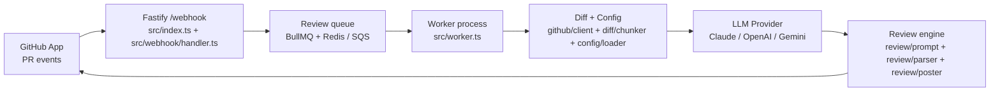

## Revelio Code Reviewer

[](LICENSE)

**Revelio** is a self-hosted, open source, AI-powered pull request reviewer for GitHub.  
It behaves like a pragmatic senior engineer: **no nitpicks, no style wars, only comments on bugs, security issues, logic errors, and architectural problems** worth blocking a merge.

### Key features

- **High-signal reviews only**: Focuses on `bug`, `security`, `logic`, and `architecture` issues. Ignores formatting, style, and naming nitpicks.
- **Bring-your-own LLM**: Pluggable provider layer with **Claude**, **OpenAI**, and **Gemini** implementations. Switching providers is a config change, not a code change.
- **First-class GitHub integration**: Runs as a **GitHub App**, listens to PR webhooks, and posts inline review comments directly on your pull requests.
- **Async, resilient pipeline**: Webhook → queue (BullMQ/Redis) → worker process with retries, idempotent jobs, and structured error handling.
- **Local-first, cloud-ready**: One-command local dev via **Docker Compose**, with an AWS CDK stack that mirrors the local architecture 1:1.
- **Configurable per repo**: `.revelio.yml` lets each repository tune categories, ignored paths, chunk sizes, and severity thresholds.

## How it works

At a high level:

1. **GitHub** sends a pull request event to the Revelio **webhook**.
2. The webhook validates the signature and enqueues a **review job**.
3. A **worker** consumes jobs, fetches the PR diff, chunks it intelligently, and calls your chosen **LLM provider**.
4. The LLM returns structured JSON describing review comments, which Revelio validates, filters, and posts back to GitHub as a **review**.

### High-level flow



### Local ↔ AWS parity

Local development and production infrastructure are intentionally isomorphic:

| **Local**            | **AWS**              |
| -------------------- | -------------------- |
| Fastify on `:3000`   | API Gateway + Lambda |
| BullMQ + Redis       | SQS Queue            |
| Worker process       | ECS Fargate          |
| `.env` file          | SSM Parameter Store  |
| `docker-compose.yml` | CDK stack (`infra/`) |

If it does not translate cleanly to AWS, it does not belong in the local design.

## Quickstart

### Prerequisites

- **Node.js** 18+ and **npm**
- **Docker** and **Docker Compose**
- A GitHub account with permission to create a **GitHub App**
- API key for at least one supported LLM provider:
  - **Claude** (`@anthropic-ai/sdk`)
  - **OpenAI** (`openai`)
  - **Gemini** (`@google/generative-ai`)

### 1. Clone and install

```bash
git clone https://github.com/<your-org>/revelio.git
cd revelio
npm install
```

### 2. Environment variables

Copy `.env.example` to `.env` (or create `.env` if you prefer) and fill in the values for your environment:

- **GitHub App**
  - **`GITHUB_APP_ID`**: Numeric ID of your GitHub App
  - **`GITHUB_APP_PRIVATE_KEY`**: PEM contents of your GitHub App private key
  - **`GITHUB_WEBHOOK_SECRET`**: Shared secret used to verify webhook signatures
- **Redis / queue**
  - **`REDIS_HOST`** (optional): Hostname for Redis (default: `localhost`)
  - **`REDIS_PORT`** (optional): Port for Redis (default: `6379`)
- **LLM provider config**
  - **`LLM_PROVIDER`**: One of `claude`, `openai`, `gemini`
  - **`ANTHROPIC_API_KEY`**: API key when `LLM_PROVIDER=claude`
  - **`OPENAI_API_KEY`**: API key when `LLM_PROVIDER=openai`
  - **`GEMINI_API_KEY`**: API key when `LLM_PROVIDER=gemini`
  - **`LLM_MODEL`** (optional): Override default model name per provider

> **Note**: These names align with `src/llm/factory.ts`. If you change them, update the factory as well.

### 3. GitHub App setup

1. Go to **GitHub → Settings → Developer settings → GitHub Apps → New GitHub App**.
2. **Webhook URL**:
   - Local: `http://localhost:3000/webhook`
   - If GitHub cannot reach your machine directly, use **ngrok** or similar and point the App at `https://<your-ngrok-id>.ngrok.io/webhook`.
3. **Webhook secret**: Choose a strong secret and put it in `GITHUB_WEBHOOK_SECRET`.
4. **Permissions**:
   - **Pull requests**: `Read & write`
   - **Contents**: `Read-only`
5. **Subscribe to events**:
   - `pull_request`
6. **Generate a private key** and store its contents in `GITHUB_APP_PRIVATE_KEY`.
7. Install the App on the repository (or organization) you want Revelio to review.

### 4. Run locally with Docker

The easiest way to run Revelio locally is via Docker Compose:

```bash
npm run docker:up
```

This will:

- Start **Redis** (`redis` service)
- Start the **Fastify server** (`server` service; `npm run dev`)
- Start the **worker** (`worker` service; `npm run worker`)

The server listens on `http://localhost:3000`, matching the webhook URL you configured.

### 5. Trigger a test review

1. Push a branch to the repository where you installed the GitHub App.
2. Open a pull request that introduces an obvious bug.
3. Watch the **server** and **worker** logs:
   - You should see the webhook event being received and validated.
   - The worker should fetch the diff, call the LLM, and post a review.
4. Refresh the PR on GitHub and look for **Revelio’s review**.

## Configuration (`.revelio.yml`)

Revelio can be configured per-repository via a `.revelio.yml` file checked into the repo root.  
At startup, the worker loads and validates this file using a Zod schema in `src/config/schema.ts`.

### Example

```yaml
review:
  # Only run these categories. Others will be ignored even if the model emits them.
  categories:
    - bug
    - security
    - logic
    - architecture

  # Glob patterns for files to ignore completely
  ignore:
    - "**/*.spec.ts"
    - "**/dist/**"
    - "**/generated/**"

  # Maximum number of diff lines per LLM chunk
  maxChunkLines: 400

  # Minimum severity to surface in GitHub reviews
  minSeverity: medium # one of: low, medium, high
```

If the file is missing, Revelio falls back to sensible defaults. If it is present but invalid, the worker fails fast with a helpful error instead of silently ignoring bad config.

## LLM providers

The provider abstraction lives in `src/llm/`:

- **`src/llm/types.ts`**: Defines the `LLMProvider` interface and common types.
- **`src/llm/providers/*.ts`**: Concrete provider implementations:
  - `ClaudeProvider` (Anthropic)
  - `OpenAIProvider`
  - `GeminiProvider`
- **`src/llm/factory.ts`**: Chooses a provider based on `LLM_PROVIDER` and the relevant API key.

To switch providers:

```bash
export LLM_PROVIDER=claude   # or openai, gemini
export ANTHROPIC_API_KEY=...
```

No application code changes are required.

## Project structure

```text
revelio/
│
├── src/                    # All application source code
│  │
│  ├── index.ts             # 🚀 Fastify server entrypoint (webhook + health)
│  ├── worker.ts            # ⚙️ BullMQ worker entrypoint
│  │
│  ├── webhook/
│  │  └── handler.ts        # Receives & validates GitHub webhook events
│  │
│  ├── queue/
│  │  ├── queue.ts          # BullMQ queue definition + enqueue helper
│  │  └── jobs.ts           # Job type definitions (ReviewJobData, etc.)
│  │
│  ├── github/
│  │  ├── client.ts         # Octokit wrapper (GitHub App auth)
│  │  └── diff.ts           # Fetches raw PR diff from GitHub API
│  │
│  ├── diff/
│  │  └── chunker.ts        # Splits large diffs into LLM-sized chunks
│  │
│  ├── llm/
│  │  ├── types.ts          # LLMProvider interface — the core abstraction
│  │  ├── factory.ts        # createProvider() — reads env, returns provider
│  │  └── providers/
│  │     ├── claude.ts      # Anthropic Claude implementation
│  │     ├── openai.ts      # OpenAI GPT implementation
│  │     └── gemini.ts      # Google Gemini implementation
│  │
│  ├── review/
│  │  ├── prompt.ts         # Builds system + user prompts
│  │  ├── parser.ts         # Parses LLM JSON → ReviewComment[]
│  │  └── poster.ts         # Posts review comments back to GitHub
│  │
│  └── config/
│     ├── schema.ts         # Zod schema for .revelio.yml
│     └── loader.ts         # Loads + validates per-repo config
│
├── infra/                  # AWS CDK (TypeScript) — mirrors local arch
│  ├── bin/
│  │  └── app.ts            # CDK app entrypoint
│  └── lib/
│     └── revelio-stack.ts  # API Gateway + SQS + Lambda/ECS + SSM
│
├── tests/
│  ├── diff/
│  │  └── chunker.test.ts
│  ├── llm/
│  │  └── factory.test.ts
│  └── review/
│     └── parser.test.ts
│
├── docker/
│  └── docker-compose.yml   # Redis + server + worker for local dev
│
├── .revelio.yml.example    # Per-repo config template (sample)
├── .env.example            # Env variables template (sample)
├── package.json
├── tsconfig.json
└── README.md
```

## Development

- **Run the server only** (no Docker):

  ```bash
  npm run dev       # Fastify on http://localhost:3000
  ```

- **Run the worker only**:

  ```bash
  npm run worker
  ```

- **Type-check / build**:

  ```bash
  npm run build     # tsc
  ```

- **Tests**:

  ```bash
  npm test
  ```

Core modules (`chunker`, `parser`, `factory`) have unit tests; when changing behavior, update their respective tests under `tests/`.

## Contributing

Contributions are welcome, especially around:

- **New LLM providers** (implementing `LLMProvider` in `src/llm/providers/`)
- **Better prompts & parsing** for specific languages or frameworks
- **Additional review categories** that still honor the “no nitpicks” philosophy
- **AWS CDK improvements** and deployment guidance

Please:

- Open an issue first for larger changes.
- Add or update tests for any non-trivial behavior change.
- Keep PRs focused and well-described.

## License

Revelio is released under the **MIT License**.
